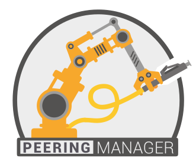

  

Peering Manager is a BGP session management tool. Initially conceived as a way
to document Internet Exchanges points and peering sessions, its goal is now to
provide a source of truth and configuration management for external BGP
sessions of all kind (transit, customers, peering, …).

Questions? Comments? Join us in the `#peering-manager` Slack channel on
[NetworkToCode](https://networktocode.slack.com/).

## Requirements

This tool is written with the
[Django framework](https://www.djangoproject.com/) with a
[PostgreSQL](https://www.postgresql.org) database and requires Python 3 with
some dependencies to run. For a complete list of requirements, see
`requirements.txt`.

Tested Python versions are 3.6, 3.7 and 3.8.

The best way to start setting up this tool is to use **pip** within a
**virtualenv**.

## Installation

Please see the [documentation](https://peering-manager.readthedocs.io/) for
instructions on installing Peering Manager.

## Helping

You can help this project in many ways. Of course you can ask for features,
give some ideas for future development, open issues if you found any and
contribute to the code with pull requests and patches. You can also support the
development of this project by donating some coins.

### Spreading The Word

  * [RIPE76 Peering Manager - Easing Peering Sessions Management](https://ripe76.ripe.net/archives/video/13/) by Guillaume Mazoyer (English)
  * [FRnOG32 Peering Automation and Documentation](https://www.dailymotion.com/video/x756n1e?playlist=x6c4hk) by Guillaume Mazoyer (French)
  * [LUNOG2 A better Internet thanks to peering and automation](https://drive.mazoyer.eu/index.php/s/3RiyrPQd3Tdwc96) by Guillaume Mazoyer (English)
