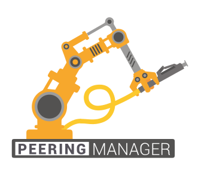

# BGP Management And Source of Truth

Peering Manager is an open source solution for modelling and documenting modern
BGP networks. It helps maintain healthy peering relationships with other
networks by providing a "source of truth" for efficient BGP session
configuration. With a powerful API and integration with industry-standard tools
such as PeeringDB, Peering Manager provides a solid foundation upon which
network automation can rely.

## :material-server-network: Built for BGP Networks

Peering Manager has a data model which specifically addresses the needs of
network engineers and operators managing BGP networks. It delivers a
comprehensive set of object types crafted to serve BGP design and documentation.

## :material-lock-open: Always Open

As an open source application licensed under [Apache
2](https://www.apache.org/licenses/LICENSE-2.0.html), Peering Manager's entire
code base is completely accessible to end users, eliminating any risk of vendor
lock-in. Additionally, Peering Manager development is an entirely public,
community-driven process to which everyone can contribute.

!!! tip "Peering Manager Development"
    Interested in contributing to Peering Manager? Check out our [GitHub
    repository](https://github.com/peering-manager/peering-manager) to get
    started!

## :material-language-python: Powered by Python

Peering Manager is built on the enormously popular
[Django](http://www.djangoproject.com/) framework for the Python programming
language, already a favorite among network engineers.

## :material-flag: Getting Started

* Try out our [public demo](https://demo.peering-manager.net/) if you want to
  jump right in
* The [installation guide](./setup/index.md) will help you get your own
  deployment up and running
* Or try the community [Docker image](./setup/container.md) for a low-touch
  approach
* Read the [getting started guide](./getting-started.md) to learn the core
  concepts and set up your first peering sessions

## :material-handshake: Helping

You can help this project in many ways. You can request features, suggest ideas
for future development, open issues if you find any, and contribute to the code
with pull requests and patches.

You can also support the development of this project by
[sponsoring it](https://github.com/sponsors/gmazoyer). Developing such a project
can be time-consuming and is done on personal time. Donating a few
dollars/euros/pounds can be a way to say thanks and help free up time for
continued development.

## :material-presentation: Spreading The Word

Take a look at [the talks](https://peering-manager.net/talks.html) about
Peering Manager to learn more about it and its use cases.
