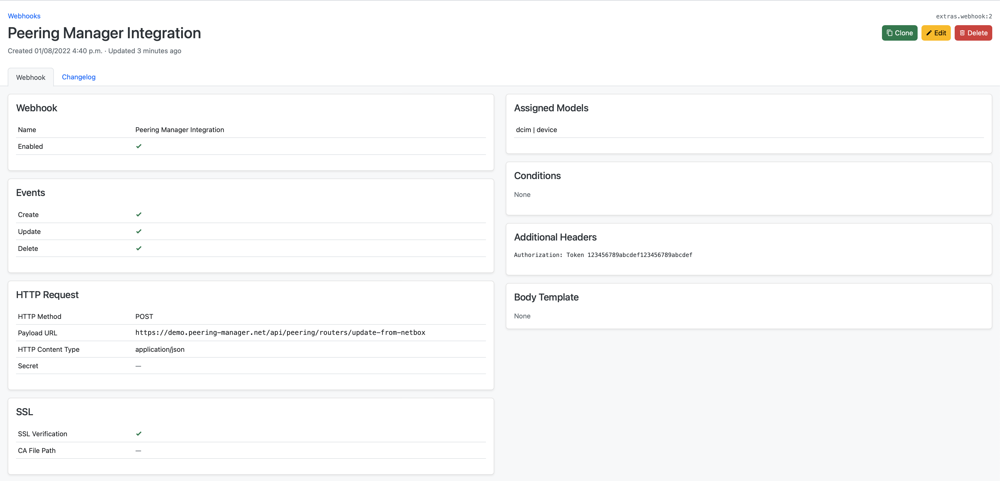

# NetBox

Peering Manager has a little integration with NetBox to improve workflows
regarding devices (routers). In most cases, users of NetBox will prefer to
avoid duplicating data from NetBox. For this particular reason, two approaches
are proposed to users.

1. When creating or deleting a router, and when using `NETBOX_API`,
   `NETBOX_API_TOKEN` with a valid values, Peering Manager will propose to the
   user to select NetBox device from a dropdown list. This only create a link
   between the two sources of truth in a very basic way.
2. Another more advanced integration, that can only works if the first one is
   also active, is to point a NetBox webhook on one of Peering Manager's API
   endpoint. In this way, Peering Manager will be able to create/update/delete
   devices based on what NetBox will send. An example of NetBox' webhook is
   displayed below. The webhook method must be `POST`, the URL must point to
   `/api/peering/routers/update-from-netbox/` and additional headers must
   contain the authentication header like `Authorization: Token <the token>`.



Example of required minimal data for the webhook integration to work (other
data won't be used, if included):

```json
{
    "event": "deleted",
    "data": {
        "id": 1,
        "display": "etz-router01.as201281.net",
        "name": "etz-router01.as201281.net",
        "device_role": {
            "id": 7,
            "url": "/api/dcim/device-roles/7/",
            "display": "Router",
            "name": "Router",
            "slug": "router"
        },
        "platform": {
            "id": 3,
            "url": "/api/dcim/platforms/3/",
            "display": "Juniper Junos",
            "name": "Juniper Junos",
            "slug": "juniper-junos"
        },
        "status": {
            "value": "active",
            "label": "Active"
        },
        "local_context_data": null
    }
}
```

Note that these integrations haven't been tested with Nautobot.
