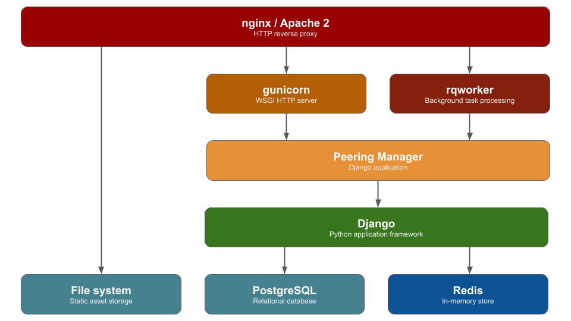

# Installation

The installation instructions provided have been tested to work on Debian 12.
The particular commands needed to install dependencies on other distributions
may vary significantly. Unfortunately, this is outside the control of the
Peering Manager maintainers. Please consult your distribution's documentation
for assistance with any errors.

The following sections detail how to set up a new instance of Peering Manager:

1. [PostgreSQL database](1-postgresql.md)
1. [Redis](2-redis.md)
3. [Peering Manager components](3-peering-manager.md)
4. HTTP server like [Apache 2](4a-apache2.md) or [nginx](4b-nginx.md)
6. [LDAP authentication](5a-ldap.md) (optional)

## Requirements

| Dependency | Minimum Version |
|------------|-----------------|
| Python     | 3.10            |
| PostgreSQL | 12              |
| Redis      | 4.0             |

## Upgrading

If you are upgrading from an existing installation, please consult the
[upgrading guide](upgrading.md).
