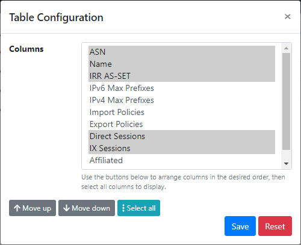
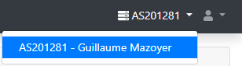
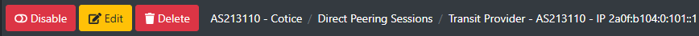
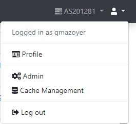

# User Interface

Beginning to use a new tool can be difficult without knowing your way around
the user interface. While Peering Manager aims to have the most straight
forward interface for you to do what you need to.

## Homepage And Navigation

The homepage gathers a set of useful information to quickly provide insights
about the state of various objects (BGP sessions, IXPs, routers, and more).

With the sidebar's help, you can switch between categories and reach pages
displaying lists of objects. Most of these lists can be sorted and their
columns can also be organized as the users feel. Note that column setup and
pagination count are individual of a user.

Each item of a list can be clicked (on the highlighted value) so you can see
specific details about the it. If an item has a relationship with another one,
you should also be able to click of the relationship to get the related item.

The navigation bar, located at the top of the screen, shows the page that you
are seeing and also displays breadcrumbs which give you the path to get to the
page and help you navigating back. To the left of the user menu, another menu
is used to select the affiliated AS you are working with.

The navigation bar also holds all the buttons to create (if you are on a
list) an object, edit and delete the object that you are reviewing. Clicking
on these buttons will get you to a form, which can sometimes be pre-filled.

## User Profile

To get to the user profile, you can click on the far right of the navigation
bar. A menu will open and you'll be able to click on the __Profile__ item.

Clicking the item will get you to a page with four tabs in which you'll be
able to review your account's details, your preferences, change your password
(if you are using the built-in authentication) and manage your API tokens.

## Working With Objects

### Creating, Updating And Deleting

All objects have actions, with corresponding buttons, to update or delete
them. In object list views, you will find a button to create objects fitting
in the displayed lists. In some cases, objects can also be edited and deleted
in batch to avoid repeating the same workflow over and over again. This is
useful, for instance, to disabled several peering sessions at once. For this,
you'll have to select the objects to change or delete in the list view and
then click the appropriate button at the bottom of the table.

When an object have one to one or one to many relationships with other
objects, before creating the main object, all its relationships must be
present. In the same way, depending on the relationship type, if you delete a
dependency to an object, the corresponding field will either be set to a null
value or the object will get deleted. As an example, if you delete an IXP's
connection, all peering sessions depending of this connection will
automatically get deleted in the process.

### Filtering

With every object list, a form to filter said list is provided allowing you to
see only objects of your interest. A form filter is based on the fields of
objects. A generic "search" field can be used to look for a text in all
(almost) text fields of an object. When combining more than of field
filtering, a logical `and` operation will be performed in the database, thus
returning objects matching **all** filters. Filtering is also available in the
API.

### Change Logging And Job Results

Peering Manager tracks changes that happen for almost all objects. Change
logging is performed when a user creates, updates or deletes one or more
objects. Object properties will be recorded so they can be reviewed later,
timestamp and author are also kept for helping people who did what and when,
therefore allowing to understand issues that might have happen.

The same kind of idea is applied to background jobs as well. Peering Manager
makes an extensive use of jobs that are run asynchronously to perform tasks
which may need several seconds or minutes to complete. You can still navigate
the user interface while tasks are running as well as scheduling more of them.
A job result namespace is available for you to track all background tasks,
their states and their results.

## API Browser

All data in Peering Manager are also exposed via a REST API. API is meant to
be used by developers so they can read and write data from other tools. While
you can do everything in the user interface, some tasks, such as importing a
batch of initial data, are more suitable for an API.

A web interface to interact with the API is under the `/api` location of your
Peering Manager instance.
